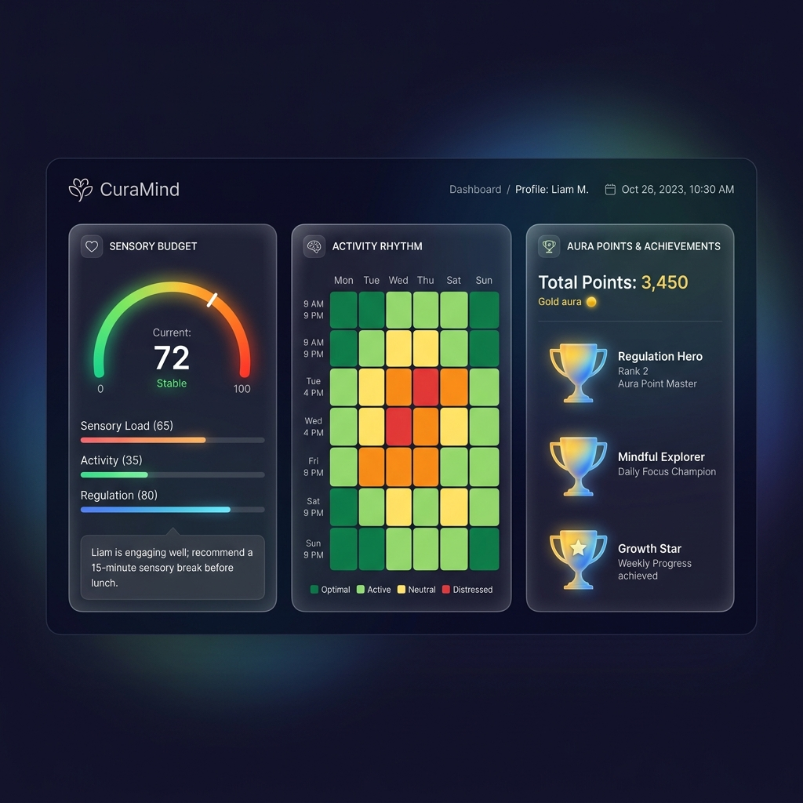
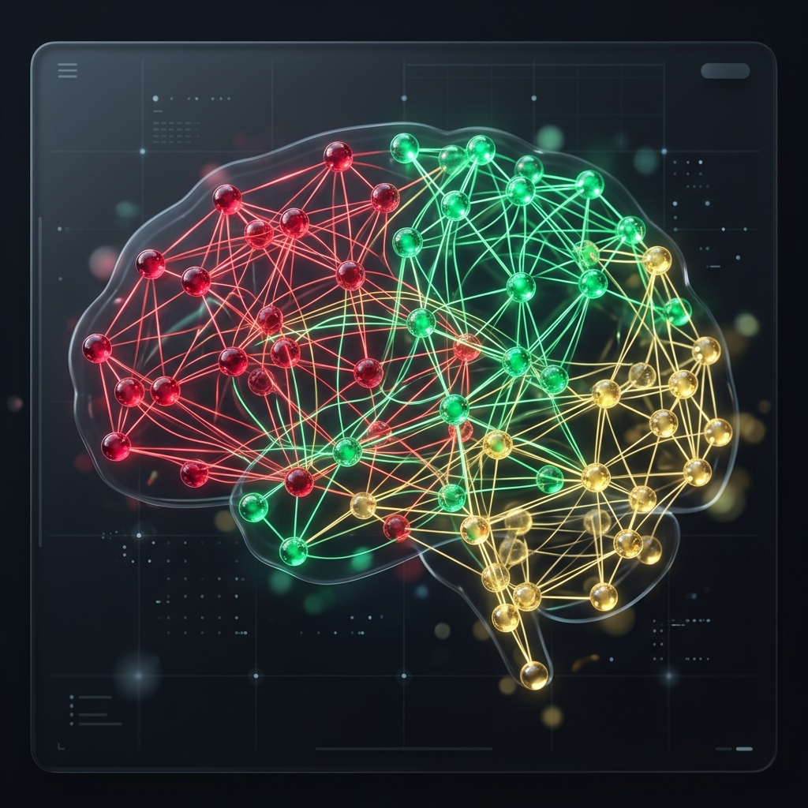
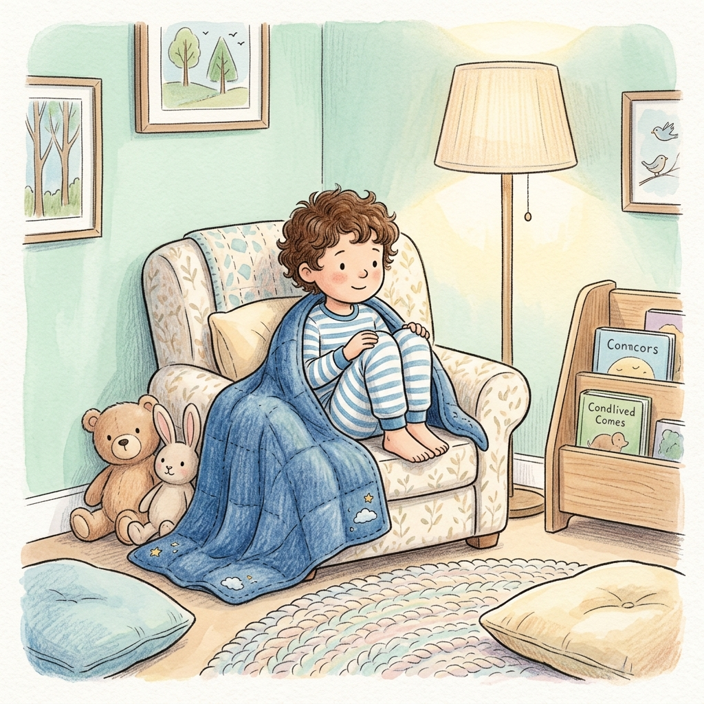

# 🩺 CuraMind AI: Sensory Support Ecosystem

[](https://vitejs.dev/)
[](https://react.dev/)
[](https://tailwindcss.com/)
[](https://supabase.com/)
[](https://deepmind.google/technologies/gemini/)

> **Simplifying the complex world of neurodiversity.** CuraMind is a premium, AI-driven platform designed to bridge the gap between parents, educators, and clinicians, providing a safe and data-rich environment for supporting neurodivergent children.



---

## ✨ Core Pillars

### 🧠 The Brain Map (Interactive Sensory Graph)
Visualize the invisible. Our interactive node graph maps a child's unique sensory landscape, connecting **Triggers** to proven **Solutions** and **Support Systems**. Powered by React Flow and Gemini 1.5 Flash.



### 📖 Social Story Architect
Transform challenging transitions into safe narratives. Enter a scenario like "Going to the Dentist," and our AI instantly crafts a Carol Gray-compliant social story complete with comforting, custom-generated illustrations.



### ⚡ Sensory Budget & Real-time Monitoring
Track "Sensory Load" in real-time. Our energy budget system helps parents predict and prevent meltdowns by monitoring daily activities and ambient noise levels, suggesting proactive "shielding" protocols.

### 🤝 The Care Circle
A secure, unified workspace for the child's entire support team. Parents, clinical leads, and teachers share observations and "Care Signals" (SOS) instantly to maintain a consistent environment across home and school.

---

## 🛠️ Technology Stack

- **Frontend**: React 19 + Vite + TypeScript
- **Styling**: Tailwind CSS 4.0 (Modern CSS-first approach)
- **Animations**: Framer Motion (Motion 12)
- **Backend**: Supabase (Auth, Real-time DB, Storage)
- **AI Core**: Google Gemini 1.5 Flash (Storytelling & Clinical Logic)
- **Graph Engine**: React Flow

---

## 🚀 Getting Started

1. **Clone & Install**:
   ```bash
   git clone https://github.com/sainath23aiml-ui/Curamind.git
   npm install
   ```

2. **Environment Variables**:
   Create a `.env` file with your credentials:
   ```env
   VITE_SUPABASE_URL=your_url
   VITE_SUPABASE_ANON_KEY=your_key
   VITE_GEMINI_API_KEY=your_key
   ```

3. **Run Development Server**:
   ```bash
   npm run dev
   ```

---

## 📱 Mobile-First Design
CuraMind is engineered for the 2:00 AM parent. Every component is meticulously optimized for one-handed mobile use, featuring:
- **Responsive Sidebar**: Hidden by default on mobile with a quick-access toggle.
- **Fluid Layouts**: Glassmorphism cards that adapt to any screen size.
- **One-Tap SOS**: Dedicated "Care Signal" trigger for urgent support.

---

## 📄 License
This project is licensed under the Apache-2.0 License.

Developed with ❤️ for the neurodiversity community.
