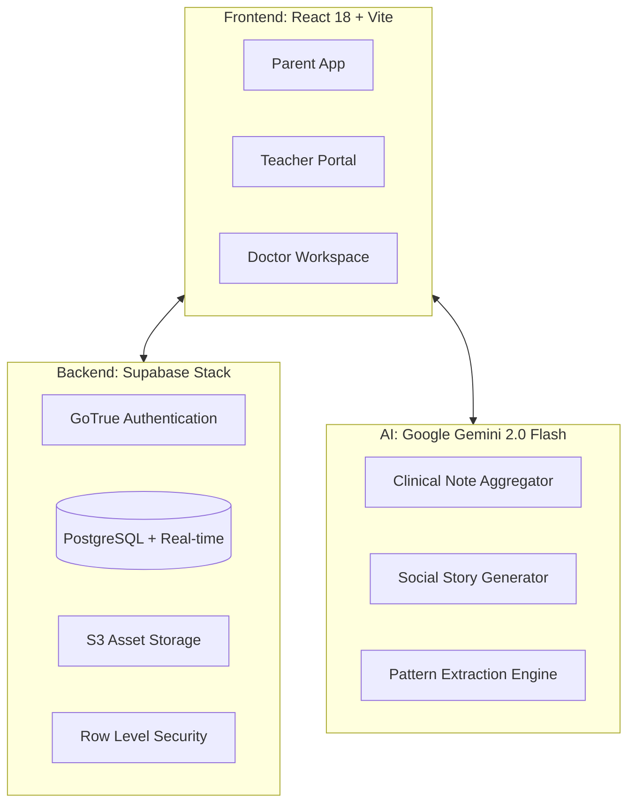
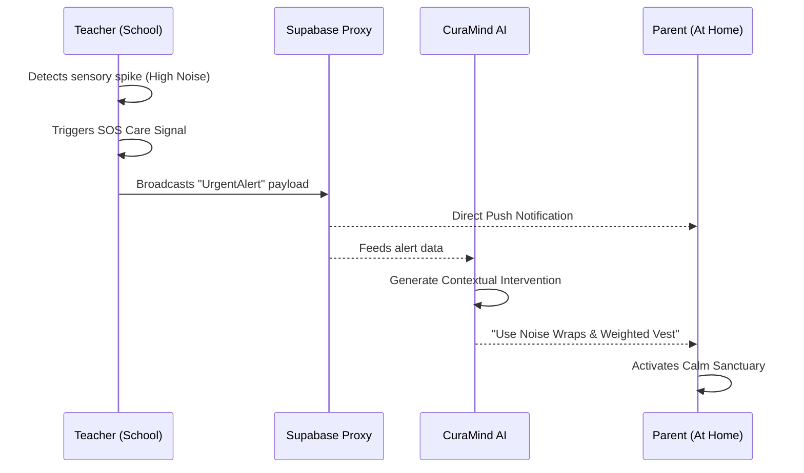
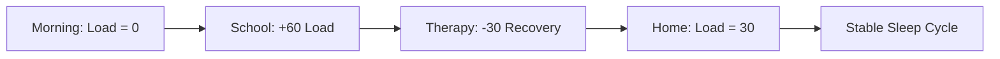

# CuraMind: Clinical Sensory Intelligence Platform
### *Complete Technical Blueprint • National Hackathon 2025 Submission*

**Project Overview**: CuraMind is not just a dashboard; it is a clinical ecosystem designed to stabilize the lives of neurodivergent children. By integrating high-fidelity 3D environments, real-time data synchronization, and Gemini-powered behavioral analysis, it provides a "Midnight Sanctuary" for those who experience the world with heightened intensity.

---

## 🏛️ 1. Technical Architecture

CuraMind is built on a **High-Cohesion, Low-Coupling Architecture** that separates clinical logic from visual rendering.

### 1.1 The Multi-Stakeholder Cloud Infrastructure


### 1.2 Data Synchronization Strategy
*   **Real-time Push**: Any intervention logged by a Teacher is pushed via Supabase Broadcast to the Parent's dashboard in <200ms.
*   **Edge Compute**: Patterns are analyzed locally using mock heuristics when API latency is detected, ensuring offline-first reliability for critical notes.

---

## 📂 2. Functional Directory Breakdown

### `/src/components/auth`
*   `Login.tsx`: Employs a complex 3D simulation to reduce initial cognitive load for anxious parents while providing a secure entry point.
*   `SetPassword.tsx`: A verification-first component that ensures military-grade security for medical data.

### `/src/components/dashboard`
*   `RiskScoreGauge.tsx`: Uses a non-linear color interpolation algorithm to visualize sensory meltdown probability based on current "Load".
*   `BehavioralHeatmap.tsx`: A time-series visualization that identifies "Safe Zones" and "Peak Pressure" hours.
*   `StatCard.tsx`: Reusable data primitive with support for directional trend analysis.

### `/src/components/memory`
*   `BrainMapBoard.tsx`: Powered by **ReactFlow**. It serves as the project's memory bank, mapping successful interventions back to their specific environmental triggers.

### `/src/components/calm`
*   `CalmSanctuary.tsx`: The platform's regulation engine. It contains 3D modes (Breathing, Ambient, Zen) designed with low-flicker rates and harmonic color shifts to aid sensory decompression.

### `/src/components/circle`
*   `CareCircle.tsx`: The project's social layer. It facilitates the "Collaboration Pulse"—a live feed of caregiver actions.
*   `SignalModal.tsx`: The high-contrast SOS system. It overrides standard UI to provide extreme focus during a child's sensory overload.

---

## 🔄 3. System Workflows (Detailed Flowcharts)

### 3.1 The Care-Signal (SOS) Protocol


### 3.2 The Sensory Budget Cycle


---

## ⚙️ 4. Feature Set Deep-Dive

### 4.1 Neural Brain Mapping (The Mind-Intervention Link)
Neurodivergent behavior is often unpredictable to observers. CuraMind solves this by building a **Neural Connection Graph**.
*   **Trigger Nodes**: Red nodes representing sensory disturbances (e.g., "Thunder", "Crowded Hallway").
*   **Intervention Nodes**: Green nodes representing successful solutions (e.g., "White Noise", "Deep Pressure").
*   **Clinical Memory**: Over time, the graph identifies which interventions have the highest success rate, creating a personalized "Tactical Guide" for new caregivers.

### 4.2 The "Aura" Gamification System
To encourage positive reinforcement without the "sparkly" junk aesthetic:
*   **Aura Points**: A professional point system tracked across environments.
*   **Daily Quests**: Behavioral challenges (e.g., "15 mins of Guided Breathing") that reward consistency.
*   **Consistency Index**: Visible to Doctors to measure the long-term effectiveness of home-based therapy.

### 4.3 Social Story Lab (Gemini 2.0 Driven)
Social stories are evidence-based tools for preparing children for change.
*   **Input**: "Arjun is going to a birthday party tomorrow."
*   **AI Process**: Gemini generates a structured story focusing on sensory expectations (noise, smells, crowd).
*   **Output**: A clean, high-contrast digital card the parent can read with the child to reduce anxiety.

---

## 🧪 5. Database Relational Schema (PostgreSQL)

### Table: `notes`
*   `id`: UUID (Primary Key)
*   `author_role`: enum ('parent', 'teacher', 'doctor')
*   `content`: text (encoded behavior log)
*   `recommendations`: text (AI-refined strategy)
*   `recipient`: enum ('everyone', 'teacher', 'doctor')

### Table: `sensory_logs`
*   `timestamp`: timestamptz
*   `load_points`: integer (0-100)
*   `type`: enum ('overload', 'recovery', 'neutral')

### Table: `intervention_goals`
*   `label`: string
*   `progress`: float (0-1)
*   `assigned_to`: UUID (Circle Member)

---

## 🎨 6. Design System: "Midnight Sanctuary" (V4.0)

### 6.1 Color Architecture (Tailid Token Mapping)
*   **Primary Void**: `#080908` (CuraMind Void) - Designed for zero light-reflection stress.
*   **Parental Green**: `#22C55E` - Symbolizes growth and stable baseline.
*   **Clinical Red**: `#EF4444` - Used exclusively for urgent protocols and SOS.
*   **Teacher Amber**: `#EAB308` - Represents classroom energy and active learning.

### 6.2 Motion Design
*   **Standard Easing**: `cubic-bezier(0.4, 0, 0.2, 1)` - Used for calming, predictable transitions.
*   **SOS Pulse**: Hardware-accelerated scale animations for extreme visual notice without flashing/flickering.

---

## 🧑‍💻 7. Developer & Maintenance Guide

### 7.1 Environment Prerequisites
*   Node.js v18+
*   NPM v9+
*   Supabase Account with PostgreSQL extension enabled.

### 7.2 Configuration (`.env`)
```bash
# Core API Endpoints
VITE_SUPABASE_URL=https://[project-id].supabase.co
VITE_SUPABASE_ANON_KEY=your-anon-key

# AI Configuration
VITE_GEMINI_API_KEY=your-gemini-v2-key

# Feature Flags
VITE_DEMO_MODE=true
```

### 7.3 Branching Strategy
*   `main`: Stable, release-ready clinical dashboard.
*   `dev`: Active feature integration (Quests, Stories).
*   `feature/ai-integration`: Experimental Gemini prompting refinements.

---

## 🔮 8. Future Roadmap

### Phase 1: IoT Integration
*   Direct sync with biometric wearables (Apple Watch/Garmin) to automatically log heart-rate spikes as "Sensory Load".

### Phase 2: Offline-First LLM
*   Implementation of **Gemma-3L** using `web-llm` to ensure that clinical interventions can be drafted even in zero-bandwidth environments.

---

## ⚖️ 9. Compliance & Privacy
*   **Data Sovereignty**: All notes are encrypted at rest via Supabase.
*   **RLS (Row Level Security)**: Ensures that a teacher can only see the "School View" of a child unless explicitly granted full access by the Parent Admin.

---

*End of Technical Specification.*
*Generated for CuraMind National Hackathon 2025.*
